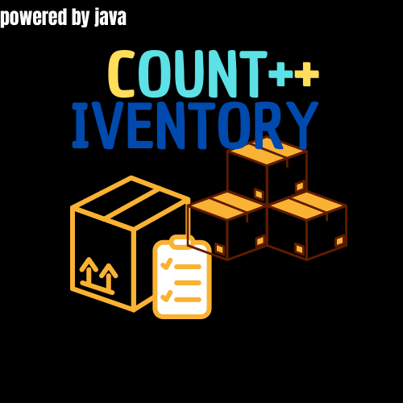

<h1> Final work Fatec Santana de Parnaíba</h1>
<h2>This repositore is a project of students from Fatec Santana de Parnaíba</h2>
 

<h3><b>Developers</b><h3>
<h4>

</h4>

<h1 logo align="center"><b>Count ++ Iventory</h1>
 

<h3>## Description project<h3>

